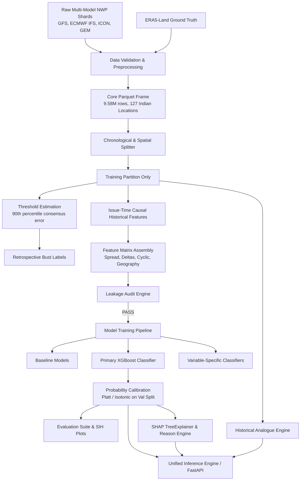

# Nirikshan ML Subsystem — Architecture & Systems Design

**SIH26079 — AI-Based Forecast Bust Detection for Medium-Range Weather Forecasts**

---

## 1. High-Level Data Flow

---

## 2. Core Architectural Principles

1. **Zero Future/Target Leakage:**
   - Ground truth (`ERA5-Land`) is consumed **strictly** to compute retrospective target labels on past data.
   - Ground truth fields and contemporaneous error columns are banned from feature matrices.
   - All historical rolling performance features (`hist_err_...`, `hist_bust_rate_...`) are computed strictly prior to forecast issue time $T$.

2. **Strict Chronological Splitting + Spatial Holdout:**
   - Split key: Forecast initialization time (`init_time` / `init_h`).
   - Early 70%: **Train**
   - Middle 15%: **Validation** (used for early stopping & probability calibration)
   - Latest 15%: **Temporal Test**
   - **Spatial Holdout:** ~20% of Indian locations are withheld from training to evaluate generalization to unseen geographical domains.

3. **Probability Calibration:**
   - Raw tree model outputs undergo post-hoc calibration (Platt scaling / Isotonic regression) fitted strictly on the validation partition.
   - Guarantees reliability curves with minimal Brier score and Expected Calibration Error (ECE).

4. **Multi-Model Disagreement Features:**
   - Variance and spread across four global NWP centers (GFS, ECMWF, ICON, GEM) provide core signals of atmospheric regime instability.

5. **Explainability & Contextual Analogs:**
   - SHAP TreeExplainer attributes individual forecast predictions to primary risk drivers.
   - Reason engine converts numeric SHAP contributions into safe, human-interpretable meteorological statements.
   - Nearest-neighbor analogue engine retrieves past verified forecasts with similar multi-model divergence signatures.
